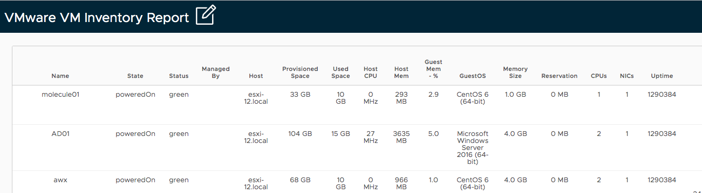

[](https://opensource.org/licenses/MIT)

# Ansible VMware VM Inventory Generator



This playbook can generate VMware VM inventory report.

## Install

Clone this repository and install ansible and the required python modules.

```
$ git clone https://github.com/sky-joker/ansible-vmware-vm-inventory-report-generator
$ cd ansible-vmware-vm-inventory-report-generator
$ pip install -r requirements.txt
```

## Usage

### Change auth variable

Please change the following variables.

```
$ vi ansible-vmware-vm-inventory-generator.yml
```

```yaml
---
- name: VMware VM Inventory Generator
  hosts: localhost
  gather_facts: no
  vars:
    hostname: vCenter IP                    # please change to ip or hostname for vCenter Server
    username: administrator@vsphere.local   # please change to vCenter Server login user name
    password: password                      # please change to vCenter Server login password
  tasks:
    - name: Gather fact for all vm
(snip)
```

### Running the Playbook

Run playbook using ansible-playbook command.

```
$ ansible-playbook ansible-vmware-vm-inventory-generator.yml
 [WARNING]: No inventory was parsed, only implicit localhost is available

 [WARNING]: provided hosts list is empty, only localhost is available. Note that the implicit localhost does not match 'all'


PLAY [VMware VM Inventory Generator] ********************************************************************************************************************************

TASK [Gather fact for all vm] ***************************************************************************************************************************************
ok: [localhost]

TASK [Gather facts for vm summary] **********************************************************************************************************************************
ok: [localhost] => (item=molecule01)
ok: [localhost] => (item=AD01)
ok: [localhost] => (item=awx)
(snip)
```

## License

MIT

## Author Information

This playbook was created by [sky-joker](https://github.com/sky-joker).
